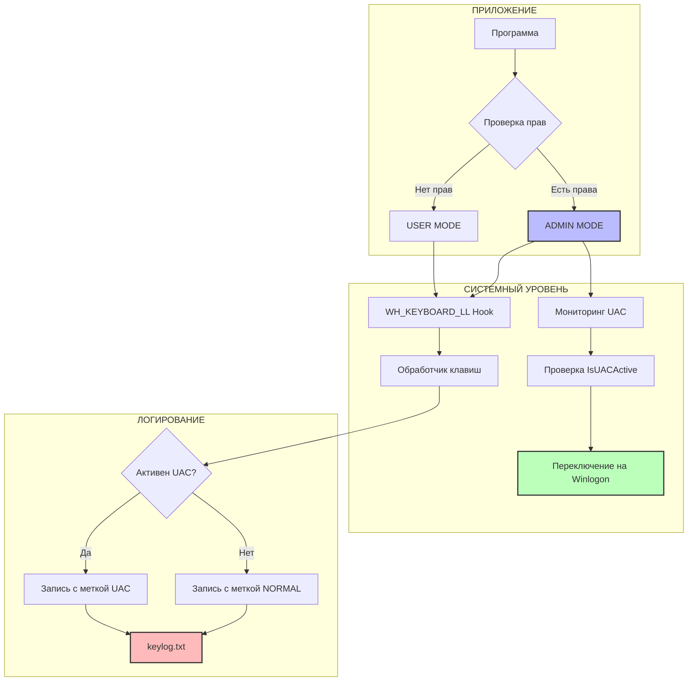

---

<p align="center">
  
</p>

<h1 align="center">
  🚀 Dual-Mode Keylogger
</h1>

<p align="center">
  <b>Исследование механизмов безопасности Windows через практическое программирование</b>
</p>

<p align="center">
  
</p>

<br>

<p align="center">
  
  
  
  
</p>

<p align="center">
  
  
  
</p>

<br>

---

## 📋 **Навигация**

<div align="center">
  
[**🎯 О проекте**](#-о-проекте) • 
[**✨ Возможности**](#-возможности) • 
[**🏗 Архитектура**](#-архитектура) • 
[**🚀 Быстрый старт**](#-быстрый-старт) • 
[**📖 Документация**](#-документация) • 
[**⚠️ Legal**](#️-юридическое-предупреждение)

</div>

<br>

---

## 🎯 **О проекте**

<div align="center">
  <table>
    <tr>
      <td width="60%" valign="top">
        <h3>🔬 Образовательный инструмент для изучения Windows</h3>
        <p><b>Dual-Mode Keylogger</b> — это уникальная возможность заглянуть "под капот" операционной системы Windows и понять, как работают её защитные механизмы.</p>
        <p>Проект демонстрирует:</p>
        <ul>
          <li>✅ Как работают глобальные хуки клавиатуры</li>
          <li>✅ Почему UAC защищает ввод паролей</li>
          <li>✅ Что такое Secure Desktop и UIPI</li>
          <li>✅ Как уровень привилегий влияет на доступ</li>
        </ul>
      </td>
      <td width="40%" align="center">
        
      </td>
    </tr>
  </table>
</div>

### 🎓 **Для кого этот проект**

<div align="center">
  <table>
    <tr>
      <td align="center" width="25%">
        <br>
        <b>Студенты</b>
        <br><sub>Изучают системное программирование</sub>
      </td>
      <td align="center" width="25%">
        <br>
        <b>Разработчики</b>
        <br><sub>Хотят освоить WinAPI</sub>
      </td>
      <td align="center" width="25%">
        <br>
        <b>Специалисты ИБ</b>
        <br><sub>Анализируют защиту ОС</sub>
      </td>
      <td align="center" width="25%">
        <br>
        <b>Системные программисты</b>
        <br><sub>Изучают низкоуровневые механизмы</sub>
      </td>
    </tr>
  </table>
</div>

<br>

---

## ✨ **Возможности**

### 🔥 **Два режима работы**

<div align="center">
  <table>
    <tr>
      <th width="50%" align="center" style="background: #2d2d2d; color: #4ec9b0;">👤 USER MODE</th>
      <th width="50%" align="center" style="background: #2d2d2d; color: #4ec9b0;">👑 ADMIN MODE</th>
    </tr>
    <tr>
      <td valign="top">
        <ul>
          <li>✅ <b>Запуск без прав администратора</b></li>
          <li>✅ Перехват обычного ввода</li>
          <li>✅ Поддержка всех раскладок</li>
          <li>✅ Работа в фоновом режиме</li>
          <li>✅ Автозагрузка через планировщик</li>
          <li>❌ <b>UAC не перехватывается</b></li>
        </ul>
      </td>
      <td valign="top">
        <ul>
          <li>✅ <b>Требует права администратора</b></li>
          <li>✅ Перехват обычного ввода</li>
          <li>✅ Поддержка всех раскладок</li>
          <li>✅ Работа в фоновом режиме</li>
          <li>✅ Secure Desktop доступ</li>
          <li>✅ <b>UAC перехватывается</b></li>
        </ul>
      </td>
    </tr>
  </table>
</div>

### 🛠 **Технические характеристики**

<div align="center">
  <table>
    <tr>
      <td align="center">
        <br>
        <b>Все клавиши</b>
        <br><sub>A-Z, 0-9, F1-F12</sub>
      </td>
      <td align="center">
        <br>
        <b>Все раскладки</b>
        <br><sub>RU, EN, и другие</sub>
      </td>
      <td align="center">
        <br>
        <b>Временные метки</b>
        <br><sub>Точное время нажатий</sub>
      </td>
    </tr>
    <tr>
      <td align="center">
        <br>
        <b>Модификаторы</b>
        <br><sub>Ctrl, Alt, Shift</sub>
      </td>
      <td align="center">
        <br>
        <b>Авто-логирование</b>
        <br><sub>keylog.txt</sub>
      </td>
      <td align="center">
        <br>
        <b>Фоновый режим</b>
        <br><sub>/min при запуске</sub>
      </td>
    </tr>
  </table>
</div>

### 🛡 **Исследуемые механизмы защиты**

| Механизм | Описание | Поведение в проекте |
|----------|----------|---------------------|
| **UIPI** | User Interface Privilege Isolation | User Mode не видит процессы High IL |
| **Secure Desktop** | Изолированный рабочий стол Winlogon | Admin Mode переключается через SwitchDesktop |
| **MIC** | Mandatory Integrity Control | Разные уровни доступа (Low/Medium/High) |
| **UAC** | User Account Control | Запрос прав, повышение привилегий |

<br>

---

## 🏗 **Архитектура**



<br>

---

## 📁 **Структура проекта**

```
📦 dual-mode-keylogger
├── 📂 src
│   └── 📄 dual_mode_keylogger.cpp     # Исходный код
├── 📂 scripts
│   ├── 📄 run_keylogger.bat            # Быстрый запуск
│   ├── 📄 keylogger_manager.bat        # Менеджер режимов
│   └── 📄 install_keylogger.bat        # Установка
├── 📂 docs
│   ├── 📄 ARCHITECTURE.md              # Архитектура
│   ├── 📄 WINAPI_GUIDE.md              # WinAPI функции
│   └── 📄 SECURITY.md                   # Безопасность
├── 📂 assets
│   └── 🖼️ screenshot.png                # Скриншоты
├── 📄 .gitignore
├── 📄 LICENSE
└── 📄 README.md
```

<br>

---

## 🚀 **Быстрый старт**

### 📥 **Способ 1: Автоматический запуск**

```bash
# 1. Клонируем репозиторий
git clone https://github.com/yourusername/dual-mode-keylogger.git
cd dual-mode-keylogger

# 2. Запускаем (программа сама скомпилируется)
run_keylogger.bat
```

### 🎮 **Способ 2: Через менеджер**

```bash
keylogger_manager.bat
```

**Меню управления:**
```
╔══════════════════════════════════════════╗
║     🔧 KEYLOGGER MANAGER v1.0           ║
╠══════════════════════════════════════════╣
║ [1] 👤 USER MODE (без прав админа)      ║
║ [2] 👑 ADMIN MODE (с правами админа)    ║
║ [3] ⏹️ Остановить программу             ║
║ [4] 📋 Просмотр лога                    ║
║ [5] 🧹 Очистить лог                     ║
║ [6] ❌ Выход                            ║
╚══════════════════════════════════════════╝
```

### ⚙️ **Способ 3: Ручная компиляция**

<details>
<summary><b>🔨 Компиляция с MinGW</b></summary>

```bash
g++ -o keylogger.exe src/dual_mode_keylogger.cpp \
    -luser32 -lgdi32 -lole32 -luuid \
    -static-libgcc -static-libstdc++ \
    -O2 -mwindows
```
</details>

<details>
<summary><b>⚙️ Компиляция с MSVC</b></summary>

```bash
cl /EHsc /Fe:keylogger.exe src/dual_mode_keylogger.cpp \
    user32.lib gdi32.lib ole32.lib uuid.lib \
    /O2 /MT
```
</details>

<br>

---

## 📊 **Пример работы**

### 📝 **Лог-файл (keylog.txt)**

```log
[2024-01-15 10:30:45][NORMAL] Hello World
[2024-01-15 10:30:46][NORMAL] [ENTER]
[2024-01-15 10:30:50][UAC] admin
[2024-01-15 10:30:55][UAC] MyP@ssw0rd2024
[2024-01-15 10:30:56][UAC] [ENTER]
[2024-01-15 10:31:00][NORMAL] Привет, Россия!
[2024-01-15 10:31:05][NORMAL] [BACKSPACE][BACKSPACE]
[2024-01-15 10:31:10][NORMAL] [CTRL+A][CTRL+C]
```

### 🎯 **Детекция UAC в реальном времени**

```
[2024-01-15 10:30:45] Программа запущена в режиме: ADMIN
[2024-01-15 10:30:46] Мониторинг UAC активирован
[2024-01-15 10:30:50] ⚡ UAC обнаружен! Переключение на secure desktop...
[2024-01-15 10:30:55] ✅ Перехват UAC активен
[2024-01-15 10:30:56] ⚡ UAC закрыт, возврат в обычный режим
```

<br>

---

## 🧠 **Технические детали**

### **Ключевые WinAPI функции**

| Функция | Назначение |
|---------|------------|
| `SetWindowsHookEx(WH_KEYBOARD_LL, ...)` | Установка глобального хука |
| `GetAsyncKeyState()` | Определение модификаторов |
| `ToUnicodeEx()` | Преобразование кодов в символы |
| `OpenInputDesktop()` | Получение текущего десктопа |
| `SwitchDesktop()` | Переключение на Winlogon |
| `GetTokenInformation()` | Проверка привилегий |

### **Фрагмент кода**

```cpp
// Установка хука в зависимости от режима
HHOOK g_hHook = SetWindowsHookEx(WH_KEYBOARD_LL, 
                                 LowLevelKeyboardProc, 
                                 g_hInst, 0);

// Проверка UAC (только в Admin Mode)
bool IsUACActive() {
    HDESK hDesk = OpenInputDesktop(0, FALSE, DESKTOP_READOBJECTS);
    wchar_t deskName[256];
    GetUserObjectInformation(hDesk, UOI_NAME, deskName, sizeof(deskName), &len);
    return wcsstr(deskName, L"Winlogon") != NULL;
}
```

<br>

---

## 📖 **Документация**

<div align="center">
  <table>
    <tr>
      <td align="center" width="25%">
        <a href="docs/ARCHITECTURE.md">
          <br>
          <b>Архитектура</b>
        </a>
      </td>
      <td align="center" width="25%">
        <a href="docs/WINAPI_GUIDE.md">
          <br>
          <b>WinAPI Guide</b>
        </a>
      </td>
      <td align="center" width="25%">
        <a href="docs/SECURITY.md">
          <br>
          <b>Security</b>
        </a>
      </td>
      <td align="center" width="25%">
        <a href="docs/TROUBLESHOOTING.md">
          <br>
          <b>FAQ</b>
        </a>
      </td>
    </tr>
  </table>
</div>

<br>

---

## 🧪 **Тестирование**

<div align="center">

| Версия Windows | Режим USER | Режим ADMIN |
|----------------|:----------:|:-----------:|
| Windows 11 Pro 23H2 | ✅ | ✅ |
| Windows 11 Pro 22H2 | ✅ | ✅ |
| Windows 10 Pro 22H2 | ✅ | ✅ |
| Windows 10 LTSC 2021 | ✅ | ✅ |
| Windows Server 2022 | ⚠️ | ⚠️ |

</div>

<br>

---

## ⚠️ **Юридическое предупреждение**

<div align="center">
  
### 🚨 **ВАЖНО: ПРОЕКТ ТОЛЬКО ДЛЯ ОБУЧЕНИЯ**

</div>

<div align="center">
  <table>
    <tr>
      <th width="50%" align="center" style="background: #00ff0022;">✅ РАЗРЕШЕНО</th>
      <th width="50%" align="center" style="background: #ff000022;">❌ ЗАПРЕЩЕНО</th>
    </tr>
    <tr>
      <td valign="top">
        <ul>
          <li>Изучение кода</li>
          <li>Тестирование на своём ПК</li>
          <li>Лабораторные работы</li>
          <li>Анализ безопасности</li>
          <li>Образовательные цели</li>
        </ul>
      </td>
      <td valign="top">
        <ul>
          <li>Запуск на чужих ПК</li>
          <li>Кража данных</li>
          <li>Коммерческое использование</li>
          <li>Распространение как malware</li>
          <li>Нарушение privacy</li>
        </ul>
      </td>
    </tr>
  </table>
</div>

### 📜 **Правовая информация**

> Использование программ для перехвата ввода без согласия пользователя является **уголовным преступлением** в большинстве стран. Автор не несёт ответственности за неправомерное использование данного кода. Нарушение законодательства о защите персональных данных преследуется по закону (ст. 138 УК РФ, GDPR, Computer Fraud and Abuse Act).

<br>

---

## 🤝 **Вклад в проект**

<div align="center">
  <table>
    <tr>
      <td align="center">
        <a href="https://github.com/yourusername/dual-mode-keylogger/fork">
          <br>
          <b>Fork</b>
        </a>
      </td>
      <td align="center">
        
      </td>
      <td align="center">
        <br>
        <b>Branch</b>
      </td>
      <td align="center">
        
      </td>
      <td align="center">
        <br>
        <b>Commit</b>
      </td>
      <td align="center">
        
      </td>
      <td align="center">
        <br>
        <b>Pull Request</b>
      </td>
    </tr>
  </table>
</div>

### **Что можно улучшить**

- 📝 Дополнить документацию
- 🐛 Исправить найденные баги
- 🔧 Добавить поддержку Windows Server
- 🌐 Сделать перевод на английский
- 📊 Улучшить логирование

<br>

---

## 📬 **Контакты**

<div align="center">
  <a href="https://github.com/yourusername">
    
  </a>
  <a href="mailto:your.email@example.com">
    
  </a>
  <a href="https://t.me/yourusername">
    
  </a>
</div>

<br>

---

## ⭐ **Поддержка**

<div align="center">
  <a href="https://github.com/yourusername/dual-mode-keylogger/stargazers">
    
  </a>
  <a href="https://github.com/yourusername/dual-mode-keylogger/fork">
    
  </a>
  <a href="https://github.com/yourusername/dual-mode-keylogger/watchers">
    
  </a>
</div>

<br>

---

<div align="center">
  
</div>

<div align="center">
  <h3>Сделано с ❤️ для образования и исследований</h3>
  <p><i>Понимание безопасности — первый шаг к её улучшению</i></p>
  <br>
  <sub>© 2024 Dual-Mode Keylogger Project</sub>
  <br>
  <sub>Windows является зарегистрированной торговой маркой Microsoft Corporation</sub>
  <br><br>
  <a href="#-навигация">⬆️ Вернуться наверх</a>
</div>

<br>

---

## 📚 **Дополнительные ресурсы**

<div align="center">
  <table>
    <tr>
      <td align="center">
        <a href="https://docs.microsoft.com/en-us/windows/win32/winmsg/about-hooks">
          <br>
          <b>Microsoft Docs: Hooks</b>
        </a>
      </td>
      <td align="center">
        <a href="https://docs.microsoft.com/en-us/windows/security/identity-protection/user-account-control/">
          <br>
          <b>Microsoft Docs: UAC</b>
        </a>
      </td>
    </tr>
    <tr>
      <td align="center">
        <a href="https://www.amazon.com/Windows-Internals-Part-architecture-management/dp/0735684189">
          <br>
          <b>Windows Internals</b>
        </a>
      </td>
      <td align="center">
        <a href="https://www.amazon.com/Rootkits-Bootkits-Reversing-Malware-Generation/dp/1593277164">
          <br>
          <b>Rootkits and Bootkits</b>
        </a>
      </td>
    </tr>
  </table>
</div>

---

<p align="center">
  <sub>Последнее обновление: 2024</sub>
</p> 
```

